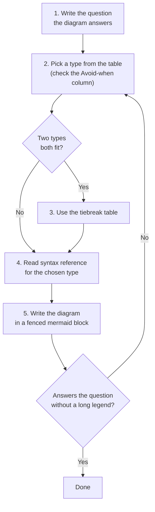
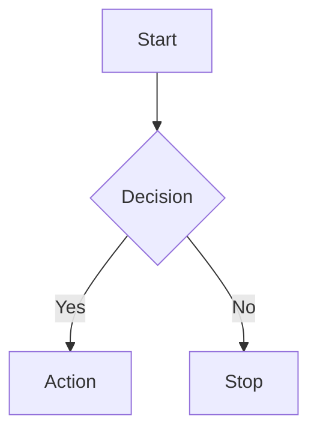
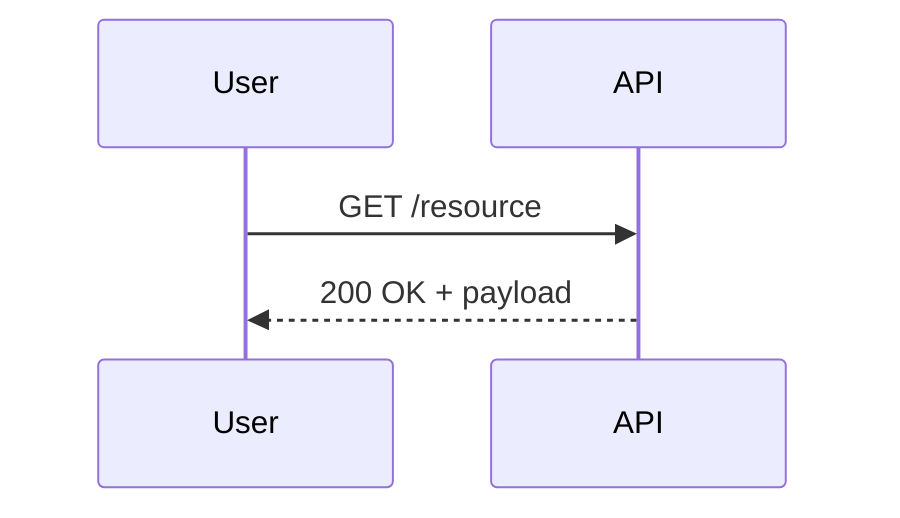
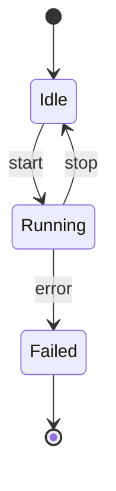
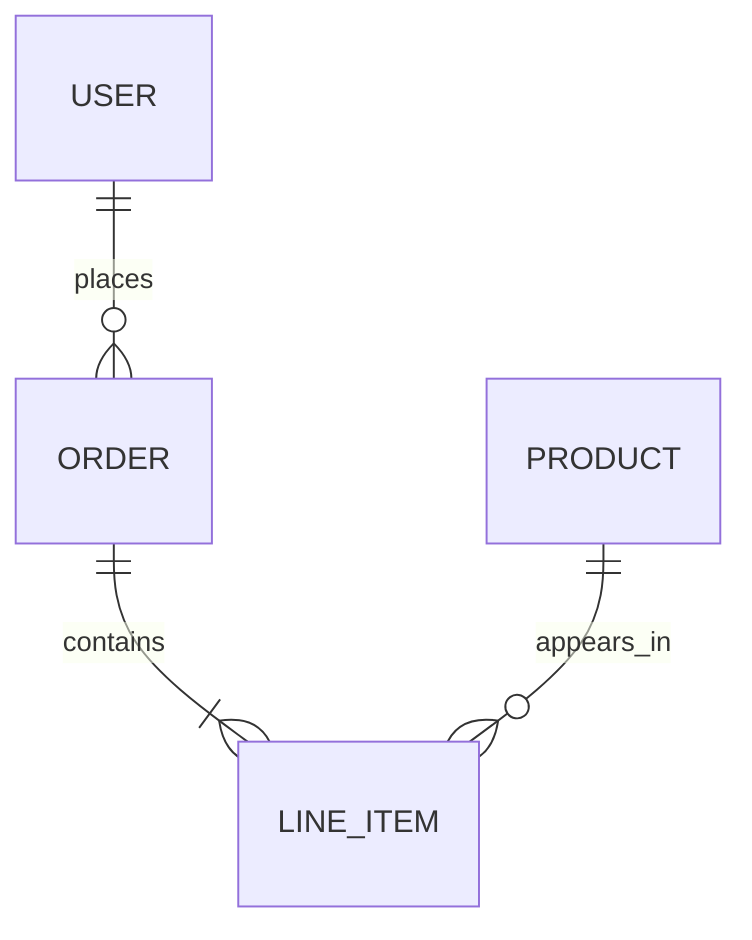
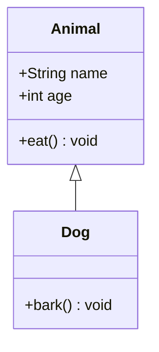
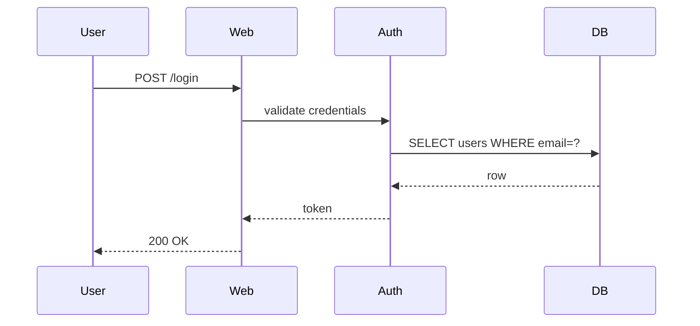

# mermaid

Diagrams that live next to prose in markdown. Mermaid is a text-based diagram language; the source ships in the same file as the document, and the renderer (GitHub, IDEs, docs sites) turns it into SVG.

The single most important decision when making a Mermaid diagram is **which diagram type to use**. Picking wrong produces a diagram that is syntactically perfect but answers a question no one asked. Picking right means even a clumsy diagram communicates.

This skill carries a curated **selection guide** (31 diagram types — when each is right, when to avoid it, how to tiebreak) and **per-diagram syntax references** sourced from the official Mermaid docs. Use them — Mermaid syntax shifts faster than memory, and the cost of one extra file read is far less than the cost of a hallucinated arrow type.

---

## When to use this skill

Use whenever a diagram will end up in a markdown file: a README, a design doc, a wiki page, a code-comment block, a Notion-flavoured doc, an issue or PR description, a Slack post that supports mermaid (some do), or inline in a prose explanation. Concretely:

- The user asks to **draw, sketch, diagram, visualize, chart, graph, or illustrate** anything.
- The user names a diagram type: "flowchart", "sequence diagram", "state machine", "ER diagram", "Gantt chart", etc.
- The user shows you an existing mermaid code block to extend, fix, or critique.
- The user asks "how does X work?" in a context where a diagram would communicate faster than prose alone (multi-step flows, multi-actor exchanges, branching logic, hierarchies, before/after states).
- You're writing documentation and a small diagram would speed comprehension.

**Do not use this skill when:**

- The user wants real data analysis or production-quality charts — use matplotlib, plotly, d3, or observable. Mermaid's `xychart`, `pie`, and `radar` are for illustration, not analysis.
- The user wants a static image (PNG/SVG) generated from arbitrary data — that's a different tool.
- The diagram is the architecture of record for a regulated or safety-critical system — formal modelling tools (PlantUML with templates, Sparx EA, Cameo) usually win there.
- The user has explicitly said "no diagram" or shown a strong preference for prose.

---

## Workflow



### 1. Write the question

Before picking anything, write down the **single question** the diagram should answer. If you can't write it in one sentence, the diagram is decoration, not communication. Examples:

- "What does the request path look like when a user logs in?"
- "What states can an order be in, and how does it move between them?"
- "How does the budget split across departments?"
- "What's the dependency order of these tasks across the next two months?"

The question is also the caption you'll put above the diagram (see Output format below).

### 2. Pick a type

Use the quick decision table. **If two diagrams seem to fit, you're probably trying to communicate two different things — split into two diagrams.**

Each row also lists the **Avoid-when** signal — the failure mode where a different type would communicate better. The marker `(beta)` or `(experimental)` flags diagrams whose syntax may shift between Mermaid versions; prefer a stable type when one fits the same question.

| If you need to show... | Use | Avoid when |
|---|---|---|
| A process with branches/decisions | **Flowchart** | strictly linear (a list is shorter); actors/systems matter more than steps — use Sequence |
| Who calls whom, and in what order | **Sequence diagram** | only one actor (Flowchart is shorter); the conversation is OOP-call-shaped (nested invocations with returns) — use ZenUML |
| A process across teams/systems, with ownership per step | **Swimlanes** *(new, syntax may evolve)* | ownership doesn't matter — use Flowchart; call ordering between two actors matters more than lanes — use Sequence |
| OOP-call-shaped conversation (nested invocations, returns, try/catch) | **ZenUML** *(experimental)* | async messages with no clear caller/callee, or activations/notes/fragments matter — use Sequence |
| How information flows over time across UI / commands / events / read models | **Event modeling** *(experimental)* | the system isn't actually event-driven, or you only need a request/response trace — use Sequence |
| User-facing steps with sentiment | **User journey** | audience is engineers debugging — they want a Flowchart or Sequence, not feelings |
| How an entity moves between states | **State diagram** | the "states" are really process steps — use Flowchart; dozens of mostly any-to-any transitions — use a transition table |
| Tables and their relationships | **ER diagram** | data is denormalized, document-shaped, or column-family — a schema snippet works better |
| OOP types and their relationships | **Class diagram** | types are bags of fields with no behaviour — use ER |
| Software architecture with formal abstraction levels | **C4** *(experimental)* | you don't need System/Container/Component/Deployment vocabulary — use Architecture or Block. Layout is partly controlled by statement order; sprites/tags/legend not yet supported |
| System components and their links (cloud-flavoured, auto-layout) | **Architecture** *(beta)* | you need exact placement — use Block; you want formal abstraction levels — use C4 |
| System components with hand-placed layout | **Block** | relationships matter more than placement — use Flowchart or Architecture |
| Requirements traceability (SysML semantics) | **Requirement diagram** | a checklist or numbered list would do — markdown is cheaper |
| Set overlaps | **Venn** *(beta)* | more than 3–4 sets — becomes unreadable; use Flowchart, table, or set notation |
| Project schedule with dependencies | **Gantt** | milestones with no durations/dependencies — use Timeline; sprint tracking — use Kanban or a burndown |
| Ordered events without durations | **Timeline** | you need overlap, slippage, or critical path — use Gantt |
| Branching/merging git history | **Gitgraph** | you want project status — a real git client or Kanban communicates more |
| Open hierarchical decomposition / brainstorm | **Mindmap** | leaf sizes matter (Treemap); directory-shaped (TreeView); branches converge on one problem (Ishikawa); structure is cyclic/networked (Flowchart) |
| Hierarchy where leaf size matters | **Treemap** *(beta)* | sizes roughly equal or absent (Mindmap); not hierarchical (XY bar); values can be negative (Treemap can't represent them) |
| Directory-style hierarchy | **TreeView** *(beta)* | not tree-shaped — use Mindmap or Flowchart; sizes matter — use Treemap |
| Root causes of a problem | **Ishikawa** *(beta)* (fishbone) | open-ended brainstorm — use Mindmap; relationships aren't cause→effect — use Flowchart |
| Flow quantities between nodes | **Sankey** | quantities don't conserve across stages — Mermaid does **not** enforce conservation, so under-attributed downstream values silently lie |
| Small flat proportions of a whole | **Pie** | many slices, or slices similar in size — bar charts and Treemaps win; hierarchical data — use Treemap |
| Numeric data over a dimension (line/bar) | **XY chart** | you have real data and a real charting library available — Mermaid XY is for embedded illustration, not analysis |
| Multivariate comparison across the same axes | **Radar** *(beta)* | axes aren't comparable in scale, or more than ~3 items overlaid — becomes unreadable |
| 2x2 categorisation with author-named axes | **Quadrant** | one of the axes is fake (quadrants force two real dimensions); axes are specifically visibility × evolution — use Wardley |
| Strategic position (visibility × evolution) | **Wardley map** *(beta)* | your axes aren't visibility/evolution — use Quadrant. Note: OWM coordinate format is `[visibility, evolution]`, not `(x, y)` |
| Bit-level wire format | **Packet** | you're not describing a bit-precise structure — a table is shorter and easier to maintain |
| Work-in-progress task board | **Kanban** | audience needs durations/dependencies — use Gantt; a screenshot of the actual board may be more honest |
| Grammar/syntax rules of a language | **Railroad diagram** *(beta)* | the grammar is trivial (a sentence or table communicates it faster) |
| Which decision-making approach fits a problem's complexity | **Cynefin** *(new)* | you need a general 2x2 — use Quadrant; you're mapping a process, not classifying a problem |

### 3. Tiebreak when two fit

When two diagrams seem to fit, this table picks the winner.

| Choice | Pick the first when... | Pick the second when... |
|---|---|---|
| Flowchart vs Sequence | one actor with decisions/branches | multiple actors and message ordering is the point |
| Sequence vs ZenUML | participants exchange messages; lanes/notes/activations matter | the conversation is OOP-call-shaped (nested calls, returns, try/catch) |
| Swimlanes vs Sequence | ownership/handoff between teams or systems is the point | call ordering between two actors is the point |
| Swimlanes vs Flowchart | not only "what happens next?" matters but also "who owns this step?" | steps and branching matter more than who owns them |
| Quadrant vs Cynefin | axes are author-named, general-purpose | classifying a problem's complexity domain specifically |
| Architecture vs Block | you want auto-layout with cloud icons | you want hand-placed layout |
| Architecture/Block vs C4 | ad-hoc, no abstraction levels needed | you want System / Container / Component / Deployment discipline |
| Architecture vs Flowchart | the boxes are services with cloud icons | the boxes are general nodes with arrows of meaning |
| Mindmap vs Ishikawa | open-ended brainstorm or outline | candidate causes converging on one problem |
| Mindmap vs Treemap | structure is the point | leaf sizes carry data |
| Mindmap vs TreeView | freeform topical hierarchy | filesystem/directory-shaped hierarchy |
| Quadrant vs Wardley | author-named axes (any 2D categorisation) | visibility × evolution for tech strategy |
| Pie vs Treemap vs XY bar | small flat proportions | hierarchical with sizes / many flat values |
| State vs Flowchart | one entity has a finite set of states | a process has steps (no entity owns the state) |
| Sankey vs Treemap | flow that splits/merges across stages | hierarchical decomposition by size |
| Class vs ER | OOP types with behaviour and inheritance | tables/records with cardinality |
| Gantt vs Timeline | durations and dependencies matter | chronological events without durations |
| Gantt vs Kanban | planning future work | snapshotting current work |

### 4. Read the syntax reference

Mermaid syntax has many quirks: escaping rules, edge ordering, node-shape keywords that change between versions, and several diagram types still flagged beta or experimental whose syntax shifts. Even when you think you know the syntax, **read the reference for the chosen type before writing** — it is sourced directly from the Mermaid project's docs and is the authoritative source of truth.

The references in this skill target **Mermaid 11.16.0** (pinned in `metadata.mermaid-version` in the frontmatter — bump both on upgrade). If the renderer is on a different version, beta/experimental syntax may have shifted; verify against the reference and the live renderer.

| Type | Reference file |
|---|---|
| Flowchart | `references/syntax/flowchart.md` |
| Sequence diagram | `references/syntax/sequenceDiagram.md` |
| ZenUML | `references/syntax/zenuml.md` |
| Event modeling | `references/syntax/eventmodeling.md` |
| User journey | `references/syntax/userJourney.md` |
| State diagram | `references/syntax/stateDiagram.md` |
| Class diagram | `references/syntax/classDiagram.md` |
| ER diagram | `references/syntax/entityRelationshipDiagram.md` |
| C4 | `references/syntax/c4.md` |
| Architecture | `references/syntax/architecture.md` |
| Block | `references/syntax/block.md` |
| Requirement diagram | `references/syntax/requirementDiagram.md` |
| Venn | `references/syntax/venn.md` |
| Gantt | `references/syntax/gantt.md` |
| Timeline | `references/syntax/timeline.md` |
| Gitgraph | `references/syntax/gitgraph.md` |
| Mindmap | `references/syntax/mindmap.md` |
| Treemap | `references/syntax/treemap.md` |
| TreeView | `references/syntax/treeView.md` |
| Ishikawa | `references/syntax/ishikawa.md` |
| Sankey | `references/syntax/sankey.md` |
| Pie | `references/syntax/pie.md` |
| XY chart | `references/syntax/xyChart.md` |
| Radar | `references/syntax/radar.md` |
| Quadrant | `references/syntax/quadrantChart.md` |
| Wardley map | `references/syntax/wardley.md` |
| Packet | `references/syntax/packet.md` |
| Kanban | `references/syntax/kanban.md` |
| Swimlanes | `references/syntax/swimlanes.md` |
| Railroad diagram | `references/syntax/railroad.md` |
| Cynefin | `references/syntax/cynefin.md` |
| Cross-type examples | `references/syntax/examples.md` |

### 5. Write the diagram

Wrap the diagram in a fenced ```mermaid block (see Output format below). For the most common types, these minimal templates are correct out of the box; copy and adapt:

#### Flowchart



#### Sequence diagram



#### State diagram



#### ER diagram



#### Class diagram



For anything beyond these basics — node shapes, styling, configuration, advanced features — read the syntax reference for that type. Do not extrapolate from these starters.

### 6. Verify

Before considering the diagram done, ask:

1. **Does it answer the question?** Read the diagram with fresh eyes — if a stranger saw only the diagram and the question, would they get an answer?
2. **Is a legend longer than three lines required?** If yes, the diagram type is wrong. Split, simplify, or pick a different type.
3. **Are arrow labels carrying their weight?** Unlabeled arrows in a flowchart with decisions usually mean missing information.
4. **Is the diagram small enough to read?** Aim for under ~15 nodes, ~10 messages, or ~8 columns. Larger diagrams stop reading and start being a wall.

If any answer is no, iterate. Diagrams are cheap to rewrite.

---

## Heuristics for picking

Distilled from the selection guide. Apply these when the table feels ambiguous.

1. **Write the question first.** "Which service times out?" → sequence. "What state is an order in?" → state. "Where does the budget go?" → sankey or treemap. If you can't write a single question the diagram answers, the diagram is decoration.
2. **Count the actors.** One actor and decisions → flowchart. Multiple actors and ordering → sequence (or ZenUML if call-shaped). Multiple actors and no ordering → architecture/block (or C4 for layered abstraction).
3. **Time vs ordering vs neither.** Calendar time → Gantt/timeline. Logical ordering (step 1, step 2) → flowchart/sequence. Event-time across swimlanes → event modeling. Neither → structural diagrams (class, ER, C4, block).
4. **If the diagram needs a legend longer than three lines, it's the wrong diagram** — split it, or pick a different type.
5. **Mermaid is for explanation, not analysis.** When data quality and precision matter (real charts, real schemas, real architecture-of-record), a dedicated tool will serve better. Mermaid wins when the diagram lives next to prose in markdown.
6. **Beta means beta.** Several types are still in beta (`architecture-beta`, `treemap-beta`, `treeView-beta`, `ishikawa-beta`, `venn-beta`, `wardley-beta`, `radar-beta`, `railroad-*-beta`), Swimlanes is brand-new with syntax that may still evolve, and some are experimental (C4, ZenUML, event modeling). Their syntax may shift between Mermaid versions. Pin a known version when it matters and re-test on upgrade.

---

## Common pitfalls

- **Hallucinated syntax.** Mermaid evolves quickly and small details (the exact arrow style, the keyword for a node shape, the way to embed markdown in labels) shift between versions. Read the syntax reference even when you think you know.
- **Reserved words in node IDs.** `end` in lowercase breaks flowcharts. The letters `o` and `x` as the first character of a node id can be parsed as edge styles (`A---oB` becomes a circle edge). When in doubt, capitalize or wrap in quotes.
- **Labels: special chars and length.** Wrap labels containing parentheses, colons, or square brackets in `"..."`. Use `<br/>` to force line breaks in long labels — *especially edge labels*, which renderers otherwise auto-wrap at unfortunate boundaries. HTML entities (`#quot;`, `#35;`) work for the trickiest characters.
- **Overlong diagrams.** A flowchart with 40 nodes is a debugging session, not a diagram. Break it into a top-level overview plus zoomed-in subdiagrams.
- **Auto-layout fights.** When `flowchart` or `architecture` produces a tangle, switch to `block` for hand-placed layout instead of fighting the layout engine with positional hacks.
- **Beta diagram surprises.** A diagram that worked yesterday may emit a parse error after a Mermaid bump. Check the syntax reference for the current syntax and confirm the renderer's Mermaid version.
- **Quantities that don't conserve.** In Sankey, viewers infer flow conservation from the visual. If sources don't equal sinks, the diagram silently lies. Audit the numbers before publishing.
- **Diagrams as a substitute for clear thinking.** If the system itself is confused, the diagram will be too. Picking the wrong diagram type is often a tell that the underlying idea hasn't been pinned down — go back and write the question.

---

## Output format

Default to a single ```mermaid fenced block, immediately preceded by a one-line italic caption stating the question the diagram answers. Example:

````markdown
*How does the login request flow through our services?*


````

For diagrams that benefit from configuration (theme, layout direction, custom styles), put a YAML frontmatter block inside the diagram:

````markdown
```mermaid
---
title: Login flow
config:
  theme: neutral
---
sequenceDiagram
    ...
```
````

If the user explicitly asks for raw mermaid source (for embedding in another tool), provide it without the markdown fence.

---

## When you need more depth

- **Authoritative syntax** → `references/syntax/<type>.md`. Treat these as truth when memory disagrees.
- **Cross-type examples** → `references/syntax/examples.md`.

---

## Final guardrails

- **Start with the question, not the diagram type.** Picking a type before knowing what you're answering is how diagrams become decoration.
- **Read the syntax reference before writing.** It's cheap (one file) and prevents the most common failure mode: hallucinated syntax.
- **Don't ship a diagram larger than ~15 nodes without offering to split it.** A wall of boxes stops being a diagram.
- **Prefer a stable diagram type over a beta one when both fit the same question.** Beta syntax shifts between releases.
- **Don't claim Mermaid renders something it doesn't.** If unsure whether a feature exists, check the syntax reference rather than guessing.
