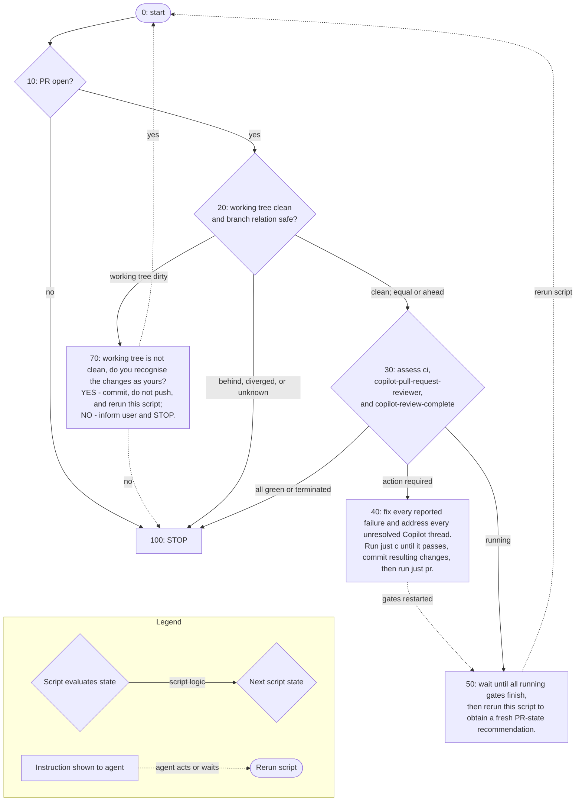

# Resolve PR Review Comments

1. Resolve the directory containing this `SKILL.md` as `THIS_SKILL_MD_DIR`.
2. With the repo root as `cwd`, execute bundled script:

```bash
<THIS_SKILL_MD_DIR>/scripts/pr_loop_state.py
```
3. Follow its instructions. After `just pr`, wait 3 minutes before the first rerun; Copilot cannot normally finish sooner. For later waits, run `sleep 60`, then rerun the script and follow the new instructions.

## Non-obvious constraints

- At step 40, ensure the full `just c` gate passes, then push only with `just pr` - the only correct way to retrigger Copilot review.
- Validate Copilot findings thoroughly - it is wrong approximately 30% of the time.
- There is normally a separate human-review gate that prevents final auto-merge.
- Fix valid findings and explain why invalid findings should not be applied, then resolve every addressed thread.
- If every thread is resolved but `copilot-review-complete` still shows the previous failure, run `just pr` once: its draft-to-ready transition emits `ready_for_review` and reruns the watcher without an empty commit.
- For a false positive, update `.github/copilot-instructions.md` only when a short, general instruction would reliably prevent it recurring; otherwise leave the file unchanged.
- Do not treat a Copilot review as stuck until it has run for 12 minutes. After that, verify that it is still progressing; stop and inform the user if it is stuck or broken.
- When Copilot findings are valid and you are applying the fix, take extra care to prevent scope creep, minimize new lines of code to your best ability.

## Decision tree

*Which recommendation does the script produce from the state it polls?*


