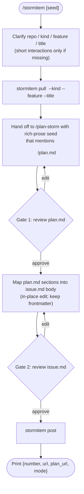

# stormitem — issue + draft PR + plan handoff

`stormitem` ships a CLI on PATH (`stormitem pull|post|registry`). This SKILL.md
is a thin orchestrator: derive args from the seed, call `pull`, hand off to
`/plan-storm`, run two human review gates, then call `post`. The CLI owns
every deterministic mechanic — templates, frontmatter, slugs, branches, PR
titles, push-access detection, gist fallback, cleanup. SKILL.md never thinks
about any of those.

Output of every CLI call is **TOON** (Token-Oriented Object Notation).

## When to use

- The user runs `/stormitem [rough idea]`.
- Mid-task, a sibling agent invokes this skill with a rich observation about
  a bug, gap, or follow-up worth tracking against a registered repo.
- The user says "raise an issue against `<repo>` for X", "let's storm a
  feature on `<repo>`", or similar.

Do **not** use this skill to comment on or close existing issues, to search
for duplicates, or to land code directly. The output is always issue +
draft PR + plan; the auto-implementing agent (or the user) takes it from
there.

## Modes

Both modes follow the same flow — only the seed shape differs.

| Mode | Trigger | Seed |
|------|---------|------|
| **A — agent-originated** | Sibling agent invokes mid-task | A rich-prose observation: what was hit, why it matters, hypothesised fix |
| **B — user-originated** | `/stormitem [rough idea]` | Anything from one sentence to a paragraph |

## Flow



## Step 1 — Clarify args

The CLI requires four pieces: `<repo>`, `--kind`, `--feature`, `--title`.

- **repo** — short name, must be in the registry. Run
  `stormitem registry` if you need to inspect what's known. Today the
  registry covers `zyp-skills`.
- **kind** — Conventional Commits type: `feat`, `fix`, `docs`, `refactor`,
  `perf`, `chore`, `test`, `build`, `ci`, `style`, `revert`. Pick from
  the seed's intent.
- **feature** — Conventional Commits scope; per-repo. For
  `zyp-skills` it's a skill name (`peek`, `mermaid`, etc.).
- **title** — short imperative phrase describing the change. Spaces are
  fine; the CLI converts spaces to underscores in the slug and back to
  spaces in the PR title.

Extract each from the seed if you can. **Only ask the user for what's
genuinely missing or ambiguous** — at most one short clarification round
covering everything in one shot. Never ask for things the seed already
makes obvious.

## Step 2 — Pull

```bash
stormitem pull <repo> --kind <K> --feature <F> --title "<raw title>"
```

The CLI fetches the target repo's `.github/ISSUE_TEMPLATE/` (with a
substring-heuristic match against `kind`) or falls back to a built-in
skeleton, writes a populated `issue.md` (with `stormitem:` frontmatter)
into a fresh `/tmp/stormitem-<slug>-XXXXXX/` directory, and prints TOON:

```text
dir: /tmp/stormitem-feat_peek_support_julia-XXXXXX
slug: feat_peek_support_julia
template_used: builtin:feat
issue_path: /tmp/stormitem-.../issue.md
```

Capture `dir` for the next steps.

## Step 3 — Hand off to /plan-storm

Invoke `/plan-storm` with a **rich-prose seed**, not directives. The seed
must mention the save path naturally so plan-storm writes the plan there.
Example seed:

> The user wants to add Julia language support to the `peek` skill. The
> skill currently inspects parquet via DuckDB; Julia files (`.jl` source,
> not data files) would be unrelated, so this is more about extending
> `peek`'s scope to non-parquet inputs. Please storm this against
> `<dir>/plan.md`. Treat it as a feature plan for the zyp-skills
> repo, scope `peek`.

`/plan-storm` runs its own protocol and stops at its default 95% readiness
threshold.

## Step 4 — Gate 1 (plan review)

When plan-storm stops, print the plan path to the user verbatim and ask
for approval:

```text
📋 Plan ready at <dir>/plan.md.
Reply: `approve`, `edit <notes>`, or `abort`.
```

- **approve** → proceed to step 5.
- **edit \<notes\>** → hand back to /plan-storm with the notes as a fresh
  seed mentioning the same `<dir>/plan.md`.
- **abort** → stop. Leave `<dir>` in place; if it's not under `/tmp/` the
  user can clean it up themselves.

## Step 5 — Map plan into issue body

Read both `<dir>/issue.md` and `<dir>/plan.md`. The issue.md template
defines a body shape (sections like `## Summary`, `## Motivation`, etc.
for `feat`; `## What's broken`, `## Steps to reproduce`, etc. for `fix`).
Fill each section with the matching content from the plan, written from
the user-perspective, not the implementer's.

**Do not inflate the issue.** Keep it short — template-mapped sections
only, plus a "Plan: see linked PR / gist" pointer (the CLI will add the
exact link after `post`). The detailed plan content stays in the PR
branch (or the gist). Length is not a concern, but readability is.

Edit `issue.md` in place. **Preserve the YAML frontmatter exactly** — the
`stormitem:` block drives `post`. Only rewrite the body below the `---`
delimiter.

## Step 6 — Gate 2 (issue review)

Print the issue path and ask for approval:

```text
📝 Issue ready at <dir>/issue.md.
Reply: `approve`, `edit <notes>`, or `abort`.
```

- **approve** → proceed to step 7.
- **edit \<notes\>** → rewrite the body per the notes, preserve
  frontmatter, re-prompt.
- **abort** → stop.

## Step 7 — Post

```bash
stormitem post <repo> <dir>
```

The CLI:

1. Reads `<dir>/issue.md` frontmatter for kind/feature/title/slug.
2. Detects push access (`gh api repos/{owner}/{repo} --jq '.permissions.push'`).
3. **PR mode** (push allowed): creates the issue, branches `stormitem/<slug>`
   off the default branch, commits `plan/<slug>/plan.md`, opens a draft
   PR titled `<kind>(<feature>): <title>` with `Closes #N`, and edits the
   issue with a `Plan PR: #M` linkback.
4. **Gist fallback** (read-only repo): creates a gist with `plan.md`,
   then creates the issue with a `📋 [Storming plan](<gist-url>)` footer.
5. Cleanup: if `<dir>` is under `/tmp/`, leaves it for OS cleanup; else
   `rm -rf <dir>`.

Output is TOON:

```text
number: 42
url: https://github.com/zyplux/zyp-skills/issues/42
plan_url: https://github.com/zyplux/zyp-skills/pull/43
pr_number: 43
mode: pr
template_used: builtin:feat
```

(`pr_number` is `null` and `plan_url` is the gist URL in gist mode.)

Print this to the user as the closing line.

## On failure

The CLI is fail-loud and optimistic — no resume / idempotency. If `post`
exits non-zero, the error names the last successful step. The temp dir is
**left intact**. The user resolves any partial repo-side state manually
(e.g. delete a half-created branch) and re-runs `stormitem post <repo>
<dir>`. Do not re-run `pull` — the dir already exists and the slug must
match.

## Rules of engagement

- Never inline plan content into the issue body — the issue stays small,
  the plan lives in the PR branch (or gist).
- Never modify the `stormitem:` frontmatter block in `issue.md`. Only
  edit the body.
- Never call `gh` directly — always go through the CLI. The CLI owns the
  repo, branch, PR, and gist mechanics.
- Never re-derive slug, branch name, or PR title in SKILL.md. The CLI
  produces them and round-trips them through `issue.md` frontmatter.
- Never skip a review gate, even when the user seems impatient — the gate
  is the safety net that justifies the optimistic posting.
